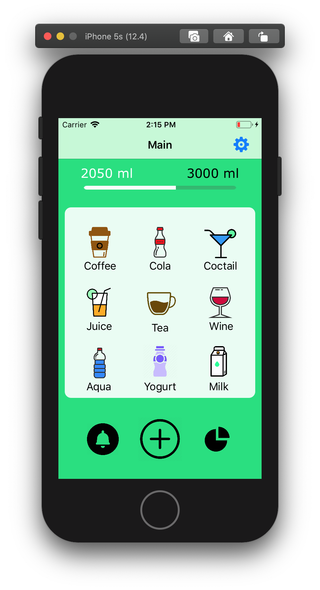
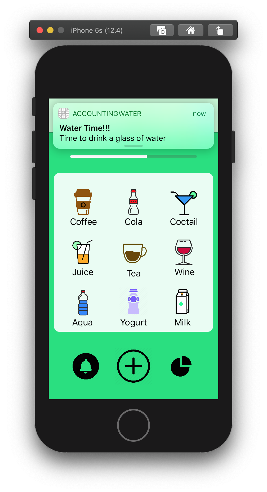
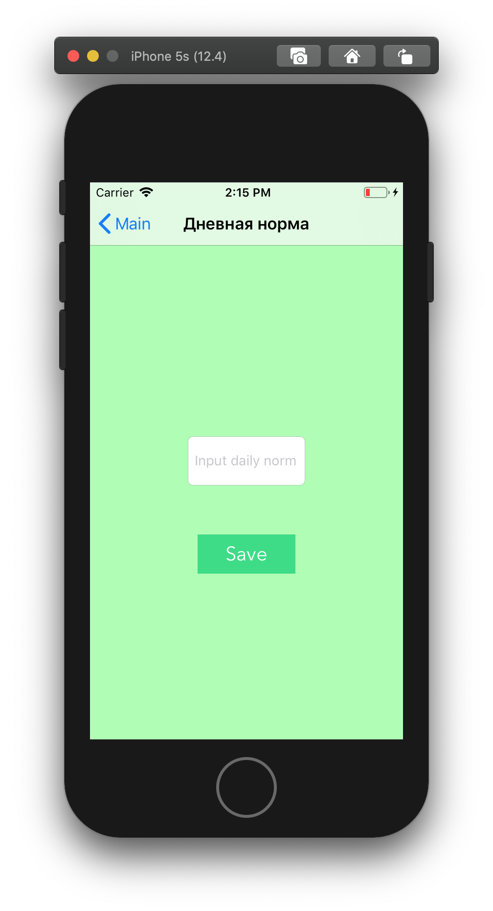
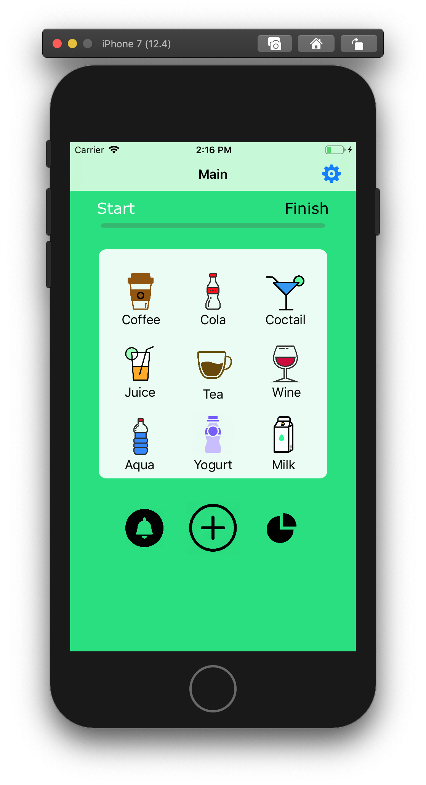
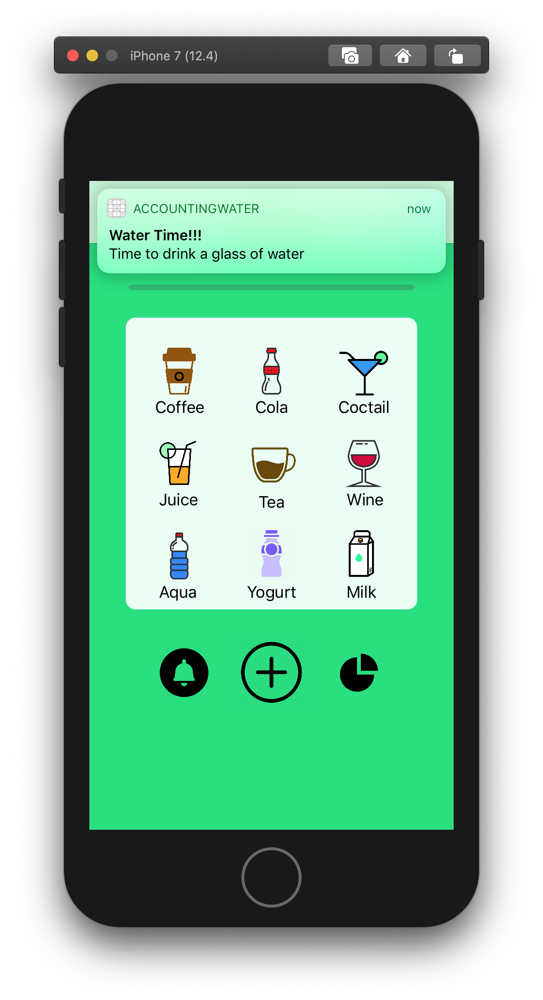
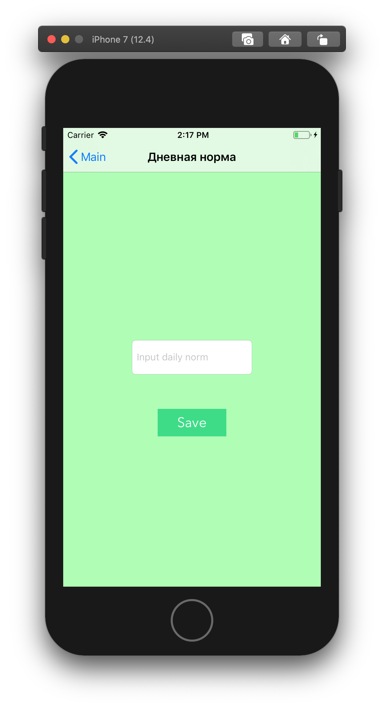

# **AccountingWater**
    
### Скриншоты:
#### iPhone 5s
  
#### iPhone 7
  
#### iPhone 11 Pro Max
  
 
Данный проект представляет собой iOS-приложение для учета выпитой воды

Реализованные фичи:
* Экран с текущим статусом
* Экран добавления дневного лимита(Daily norm)
* Экран ручного ввода выпитой воды(Custom)
* Заполение progress view при нажатии кнопок

Не реализованные фичи:
* Работа с лоакльным хранилищем
* Нотификации напоминалки

Обязательные фичи:
* Экран с текущим статусом
* Экран добавления записи
* Работа с локальным хранилищем

Будущие фичи
* Изменение дизайна
* Работа с локальным хранилищем
* Анимация переходов и отображения данных 
* CircleBar

Advanced Фичи:
* Нотификации напоминалки

[Подборка](https://itunes.apple.com/ru/story/id1382624733)

[Пример дизайна](https://dribbble.com/shots/3834614-Drink-Water-Reminder-App-Concept)
